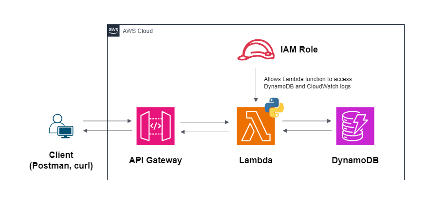

# AWS-Python-Serverless-CRUD-API
  
A Python-based CRUD API that is running behind AWS serverless technologies such as API Gateway, AWS Lambda, and DynamoDB. The application involves user being able to retrieve, create, delete, and modify product information by invoking the API's URL.
